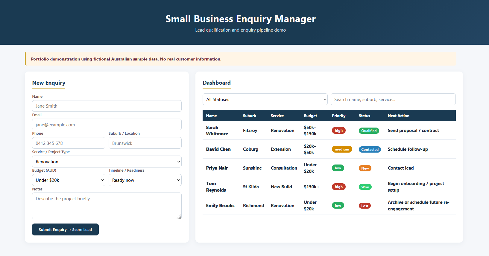

# Small Business Enquiry Manager — Portfolio Demo

> **This is a fictional portfolio/demo project.** Not built for any real client. Uses fictional Australian sample data. No real customer data, logos, secrets, or paid APIs.

## Demo




## Problem
Small service businesses lose leads because enquiries are unqualified, untracked, and scattered across email. A lightweight qualification and tracking system improves response speed and conversion visibility.

## Solution
A single-page responsive app: enquiry form → rule-based lead scoring (High / Medium / Low) with reasons → dashboard with search/filter, status tracking (New, Contacted, Qualified, Won, Lost), and recommended next actions.

## Features
- Responsive enquiry form (name, email, phone, suburb, service, budget, timeline, notes)
- Rule-based lead scoring with priority reasons
- Dashboard with search/filter by status, name, suburb, service
- Status pipeline and next-action recommendations
- Fictional Australian sample data

## Technology
Static HTML + CSS + JS frontend; Python scoring module (`scoring.py`); no backend server or database required; runs in any modern browser.

## Scoring Logic
Priority is calculated only from two structured qualification factors:

- Timeline/readiness: Ready now = 3, Within 1 month = 2, Within 3 months = 1, Just exploring = 0
- Budget: $150k+ = 3, $50k–$150k = 2, $20k–$50k = 1, Under $20k = 0

Priority thresholds:
- High: 5–6
- Medium: 3–4
- Low: 0–2

Free-text notes do not affect scoring.


## Setup / Run
```bash
cd /project
python -m http.server 8000
# Open http://localhost:8000/index.html
python tests/test_scoring.py
```

## Limitations
- Static demo; no persistent database or multi-user auth
- Scoring rules are simplified for demonstration
- No email/notification integrations
